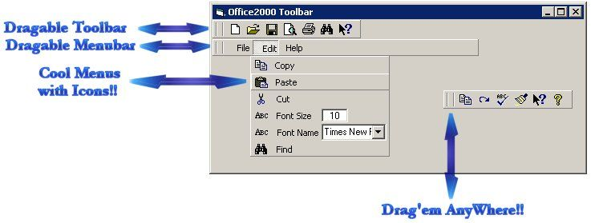



## Office2000 Toolbar

### Description

Make your toolbars like Office2000's it's COOL, Menu's with Icons, Dragable Toolbars, Dragable Menubars.

USING ONLY THE COMMON MICROSOFT TOOLBAR!!!
 
### More Info
 

             |
---                |---
**Submitted On**   |2001-08-12 23:09:54
**By**             |[Hussain Al\-Omran](https://github.com/Planet-Source-Code/PSCIndex/blob/master/ByAuthor/hussain-al-omran.md)
**Level**          |Beginner
**User Rating**    |4.6 (41 globes from 9 users)
**Compatibility**  |VB 5\.0, VB 6\.0
**Category**       |[Custom Controls/ Forms/  Menus](https://github.com/Planet-Source-Code/PSCIndex/blob/master/ByCategory/custom-controls-forms-menus__1-4.md)
**World**          |[Visual Basic](https://github.com/Planet-Source-Code/PSCIndex/blob/master/ByWorld/visual-basic.md)
**Archive File**   |[Office2000245308122001\.zip](https://github.com/Planet-Source-Code/hussain-al-omran-office2000-toolbar__1-26127/archive/master.zip)

### API Declarations

no api's

